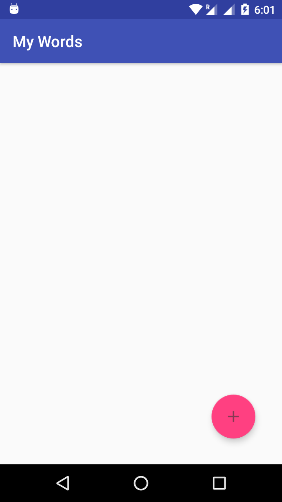
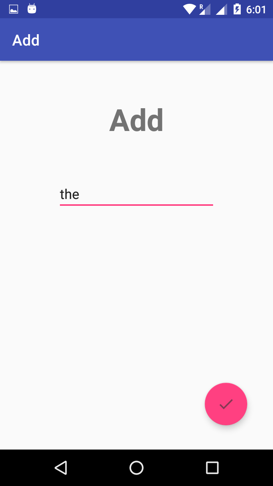
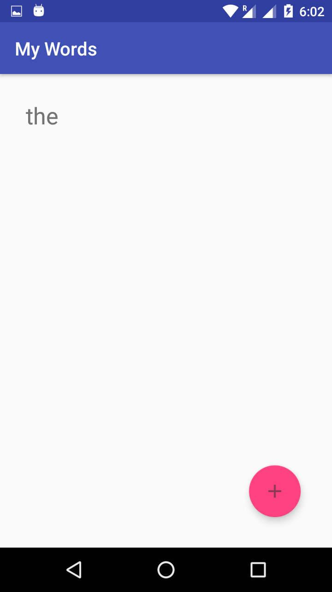
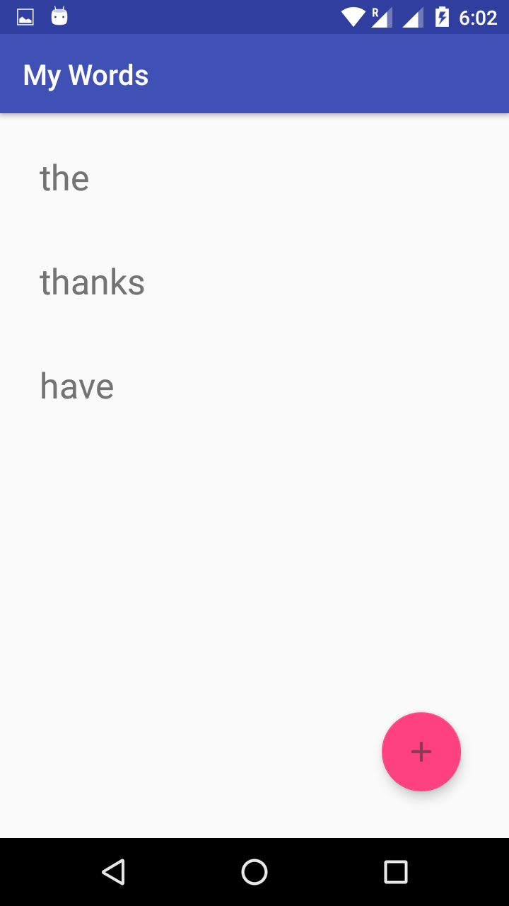

# Works app (Android architecture components)

Simple words app that save word in Database (Room Datadase). It show's you how to get start with Android architecture components.

Database Operation:-

1) Insert.
2) Delete.

## Screenshots:- 

  

 

